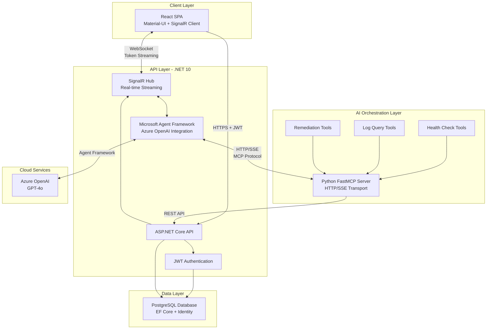
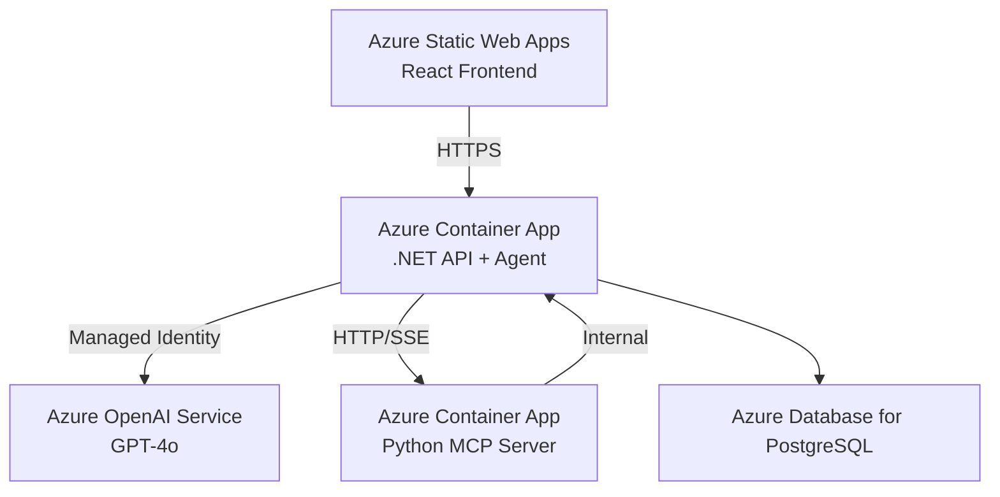

# Incident Commander

A **AI incident management platform** featuring real-time agent orchestration, autonomous diagnostics, and automated remediation through the Model Context Protocol (MCP).


---

## 🎯 Project Overview

Incident Commander demonstrates **enterprise-grade AI agent integration** by combining Microsoft Agent Framework, Azure OpenAI, and the Model Context Protocol to create an autonomous incident response system. The platform features:

- **Real-time AI Agent Chat** - Streaming token-by-token responses via SignalR WebSockets
- **Autonomous Diagnostics** - AI agents analyze system logs and diagnose root causes
- **Automated Remediation** - Agents execute recovery actions through MCP tool calls
- **Production Architecture** - Containerized microservices ready for Azure deployment

Built to showcase modern full-stack development, AI orchestration, and cloud-native patterns.

---

## 🏗️ Architecture

### High-Level System Design



### Key Architectural Patterns

#### 1. **Multi-Tier Microservices**
- **Frontend**: React SPA with SignalR for real-time updates
- **Backend**: .NET 10 API handling orchestration, auth, and business logic
- **AI Layer**: Microsoft Agent Framework with Azure OpenAI
- **Tool Server**: Python FastMCP exposing autonomous capabilities
- **Data**: PostgreSQL with Entity Framework Core

#### 2. **Real-Time Streaming Pipeline**
```
Azure OpenAI → Agent Framework → SignalR Hub → WebSocket → React UI
     (GPT-4o)      (C# async)     (token-by-token)    (live updates)
```

Tokens stream from the LLM through the agent, across SignalR, and render live in the browser as they're generated.

#### 3. **Model Context Protocol Integration**
- **Tool Discovery**: Dynamic tool enumeration from MCP server
- **Agent Binding**: Automatic tool registration with AI agent
- **Execution Flow**: Agent autonomously invokes tools during conversations
- **Transport**: HTTP/SSE for container-to-container communication

#### 4. **Containerized Deployment**
```yaml
services:
  api:           # .NET 10 API + Agent Framework
  mcp:           # Python FastMCP Server (HTTP/SSE)
  inspector:     # MCP Debugging Tools
```

All services run in Docker containers with:
- Health checks
- Environment-based configuration
- Internal networking
- Volume persistence

---

## ✨ Key Features

### 🤖 AI-Powered Incident Management

**Real-Time Agent Chat**
- Token-by-token streaming from Azure OpenAI GPT-4o
- SignalR WebSocket for sub-100ms latency
- Conversational context preservation across thread
- Role-based access control (Admin only)

**Autonomous Diagnostics**
- AI analyzes incident logs in real-time
- Root cause identification using pattern recognition
- Multi-step reasoning through agent framework
- Tool chaining for complex investigations

**Automated Remediation**
- Service restart automation
- Self-healing workflows
- Incident resolution tracking
- Audit logging for compliance

### 🔴 Real-Time Observability

**Live Incident Streaming**
- SignalR broadcasting to all connected clients
- Structured logging with Serilog
- Timeline visualization of system events
- Database-backed persistence

**Health Monitoring**
- System status dashboard
- Active incident tracking
- Service health indicators
- Chaos engineering toggle

### 💥 Chaos Engineering

**Controlled Failure Injection**
- Database connection failures
- Simulated outage scenarios
- Resilience testing
- Agent response validation

---

## 🛠️ Technology Stack

### Frontend
| Technology | Purpose |
|------------|---------|
| **React 18** | UI framework with hooks |
| **Material-UI (MUI)** | Component library |
| **SignalR Client** | WebSocket real-time communication |
| **Vite** | Build tool and dev server |

### Backend
| Technology | Purpose |
|------------|---------|
| **.NET 10** | API framework |
| **ASP.NET Core** | Web framework |
| **Entity Framework Core** | ORM and migrations |
| **ASP.NET Core Identity** | User management |
| **SignalR** | Real-time server push |
| **Serilog** | Structured logging |

### AI & Agent Framework
| Technology | Purpose |
|------------|---------|
| **Microsoft Agent Framework** | Agentic AI orchestration |
| **Azure OpenAI** | GPT-4o language model |
| **Model Context Protocol (MCP)** | Tool protocol for AI agents |
| **FastMCP** | Python MCP server framework |

### Infrastructure
| Technology | Purpose |
|------------|---------|
| **PostgreSQL** | Primary database |
| **Docker & Docker Compose** | Containerization |
| **Azure Container Apps** | Cloud deployment (planned) |
| **Azure Managed Identity** | Cloud authentication |

### Security
| Technology | Purpose |
|------------|---------|
| **JWT Authentication** | Token-based auth |
| **HTTP-only Cookies** | XSS protection |
| **CORS Middleware** | Cross-origin security |
| **Role-based Authorization** | Access control |

---

## 🚀 Getting Started

### Prerequisites

- [.NET 10 SDK](https://dotnet.microsoft.com/download/dotnet/10.0)
- [Node.js 22+ LTS](https://nodejs.org/)
- [PostgreSQL 14+](https://www.postgresql.org/download/)
- [Docker Desktop](https://www.docker.com/products/docker-desktop)
- [Azure CLI](https://docs.microsoft.com/cli/azure/install-azure-cli) (for Azure OpenAI)

### Quick Start with Docker (Recommended)

1. **Clone and Configure**
```bash
git clone https://github.com/carsonmellblom/IncidentCommander.git
cd IncidentCommander

# Create API configuration
cd IncidentCommander.API
cp appsettings.example.json appsettings.json
# Edit appsettings.json with your settings (see below)
```

2. **Configure Azure OpenAI**

Update `appsettings.json`:
```json
{
  "Azure": {
    "OpenAI": {
      "Endpoint": "https://YOUR-RESOURCE.openai.azure.com/",
      "DeploymentName": "gpt-4o"
    }
  }
}
```

Login to Azure:
```bash
az login
```

3. **Start Services**
```bash
# From project root
docker-compose up --build
```

4. **Access Application**
- Frontend: `http://localhost:5173`
- API: `http://localhost:5294`
- MCP Inspector: `http://localhost:6274`

### Local Development Setup

For development with Python `labenv` virtual environment:

```bash
# 1. Setup Python MCP Server
cd IncidentCommander.MCP
python -m venv labenv
labenv\Scripts\activate  # Windows
# source labenv/bin/activate  # Mac/Linux
pip install -r requirements.txt

# 2. Start MCP Server
python -m src.incident_commander_mcp.server

# 3. Start .NET API (new terminal)
cd IncidentCommander.API
dotnet run

# 4. Start React Frontend (new terminal)
cd IncidentCommander.Web
npm install
npm run dev
```

Update `appsettings.json` for local mode:
```json
{
  "McpServer": {
    "UseStdio": true  // Use local Python process
  }
}
```

---

## 📁 Project Structure

```
IncidentCommander/
├── IncidentCommander.API/              # .NET 10 Web API
│   ├── Controllers/                    # API endpoints
│   ├── Services/                       
│   │   ├── McpAgentService.cs         # Agent Framework + MCP integration
│   │   └── TokenService.cs            # JWT token generation
│   ├── Hubs/                          
│   │   ├── IncidentHub.cs             # Real-time incident streaming
│   │   └── ChatHub.cs                 # AI agent chat streaming
│   └── Endpoints/                     # Minimal API endpoints
├── IncidentCommander.Infrastructure/   # Data access layer
│   └── Data/                          
│       ├── AppDbContext.cs            # EF Core context
│       └── Entities/                  # Domain models
├── IncidentCommander.Web/              # React SPA
│   ├── src/
│   │   ├── components/
│   │   │   └── AgentChat.jsx         # AI chat component
│   │   ├── pages/                     # Route pages
│   │   └── context/                   # React context (Auth)
│   └── vite.config.js                 # Vite configuration
├── IncidentCommander.MCP/              # Python FastMCP Server
│   ├── src/
│   │   └── incident_commander_mcp/
│   │       ├── server.py              # MCP server (HTTP/SSE)
│   │       └── tools.py               # Agent tool implementations
│   └── requirements.txt
└── docker-compose.yml                  # Container orchestration
```

---

## 🎮 Usage

### Admin Dashboard

1. **Login** with admin credentials
2. **Navigate to Dashboard** (Admin-only access)
3. **Initiate Chaos Protocol** to simulate failures
4. **Monitor live logs** streaming via SignalR
5. **Open AI Chat** (floating bubble in bottom-right)
6. **Ask agent**: "What is the current system status?"
7. **Watch tokens stream** in real-time
8. **Agent calls MCP tools** autonomously to diagnose and fix issues

### AI Agent Capabilities

The agent can:
- ✅ **Check system health** - Query current status and active incidents
- ✅ **Analyze logs** - Retrieve and interpret incident logs
- ✅ **Diagnose issues** - Identify root causes using AI reasoning
- ✅ **Execute remediation** - Restart services, resolve incidents
- ✅ **Multi-step reasoning** - Chain multiple tool calls to solve complex problems

Example conversation:
```
User: "Something is wrong with the database"
Agent: 🔍 Let me check the system health...
      [Calls check_health tool]
      ✅ I see there's an active database connection incident.
      📋 Let me query the logs...
      [Calls query_logs tool]
      ⚠️  Database connection failures started 5 minutes ago.
      🔧 I can restart the database service to resolve this.
      [Calls restart_service tool]
      ✅ Database service restarted successfully. Incident resolved.
```

---

## 🔐 Security Features

- ✅ **JWT Authentication** with HTTP-only cookies (XSS protection)
- ✅ **Strong password requirements** (10+ chars, complexity rules)
- ✅ **Role-based authorization** (Admin/User)
- ✅ **CORS protection** with configurable origins
- ✅ **Secrets management** via gitignored configuration
- ✅ **Azure Managed Identity** for cloud authentication
- ✅ **SQL injection protection** via Entity Framework

---

## 🚢 Deployment (Azure)

### Architecture on Azure



### Deployment Steps

1. **Build and Push Docker Images**
```bash
# Build images
docker build -t yourregistry.azurecr.io/incident-api:latest -f IncidentCommander.API/Dockerfile .
docker build -t yourregistry.azurecr.io/incident-mcp:latest ./IncidentCommander.MCP

# Push to Azure Container Registry
az acr login --name yourregistry
docker push yourregistry.azurecr.io/incident-api:latest
docker push yourregistry.azurecr.io/incident-mcp:latest
```

2. **Deploy Container Apps**
```bash
# Create resource group
az group create --name IncidentCommander --location eastus

# Deploy MCP server
az containerapp create \
  --name incident-mcp \
  --resource-group IncidentCommander \
  --image yourregistry.azurecr.io/incident-mcp:latest \
  --target-port 8000 \
  --ingress internal \
  --env-vars TRANSPORT=sse PORT=8000

# Deploy API with managed identity
az containerapp create \
  --name incident-api \
  --resource-group IncidentCommander \
  --image yourregistry.azurecr.io/incident-api:latest \
  --target-port 8080 \
  --ingress external \
  --system-assigned
```

3. **Configure Managed Identity for Azure OpenAI**
```bash
# Grant API access to Azure OpenAI
IDENTITY_ID=$(az containerapp identity show \
  --name incident-api --resource-group IncidentCommander \
  --query principalId -o tsv)

az role assignment create \
  --assignee $IDENTITY_ID \
  --role "Cognitive Services OpenAI User" \
  --scope /subscriptions/{sub}/resourceGroups/{rg}/providers/Microsoft.CognitiveServices/accounts/{openai}
```

---

## 🎓 Learning Outcomes & Technical Skills Demonstrated

This project showcases:

### Full-Stack Development
- ✅ Modern React with hooks and Material-UI
- ✅ .NET 10 Web API with async/await patterns
- ✅ RESTful API design
- ✅ Real-time WebSocket communication
- ✅ Responsive UI/UX

### AI & Agent Development
- ✅ Microsoft Agent Framework integration
- ✅ Azure OpenAI GPT-4o API usage
- ✅ Model Context Protocol implementation
- ✅ Streaming LLM responses
- ✅ Autonomous agent orchestration

### Cloud & DevOps
- ✅ Docker containerization
- ✅ Docker Compose orchestration
- ✅ Azure Container Apps deployment
- ✅ Azure Managed Identity
- ✅ Environment-based configuration

### Security & Authentication
- ✅ JWT token authentication
- ✅ Role-based authorization
- ✅ HTTP-only cookie security
- ✅ CORS configuration
- ✅ Secrets management

### Database & ORM
- ✅ PostgreSQL database design
- ✅ Entity Framework Core
- ✅ Code-first migrations
- ✅ Repository pattern

### Real-Time Systems
- ✅ SignalR for WebSocket communication
- ✅ Server-sent events (SSE)
- ✅ Token streaming
- ✅ Live dashboard updates

---

## 🔬 Future Enhancements
- [ ] GitHub Actions CI/CD pipeline
- [ ] Azure Application Insights telemetry

---

## 👤 Author

**Carson Mellblom**
- LinkedIn: [https://www.linkedin.com/in/carsonmellblom/](https://www.linkedin.com/in/carsonmellblom/)
- GitHub: [@carsonmellblom](https://github.com/carsonmellblom)

## Disclaimer

This is an example project and is for my own educational purposes only

THE SOFTWARE IS PROVIDED "AS IS", WITHOUT WARRANTY OF ANY KIND, EXPRESS OR IMPLIED, INCLUDING BUT NOT LIMITED TO THE WARRANTIES OF MERCHANTABILITY, FITNESS FOR A PARTICULAR PURPOSE AND NONINFRINGEMENT. IN NO EVENT SHALL THE AUTHORS BE LIABLE FOR ANY CLAIM, DAMAGES OR OTHER LIABILITY, WHETHER IN AN ACTION OF CONTRACT, TORT OR OTHERWISE, ARISING FROM, OUT OF OR IN CONNECTION WITH THE SOFTWARE OR THE USE OR OTHER DEALINGS IN THE SOFTWARE.
