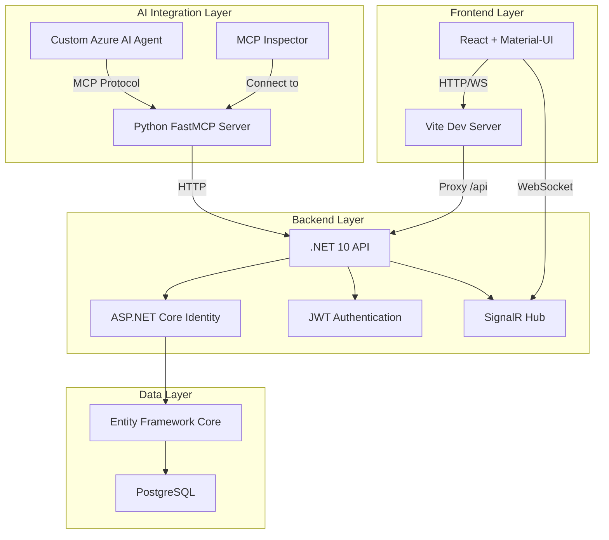

#Incident Commander

A demonstration platform showcasing real-time incident management, AI agent integration, and modern web technologies.


---

## 🎯 Project Purpose

This project demonstrates **AI-powered diagnostics** through **Model Context Protocol (MCP)**:

- **Log Generation**: Real-time incident logs simulating failure scenarios
- **MCP Exposure**: Logs and controls exposed via MCP for AI agent access
- **Agent Diagnostics**: AI agents analyze logs and diagnose root causes
- **Automated Remediation**: Agents execute fixes like restarting services

---

## 🏗️ Architecture



> **Note**: Microsoft Agent Framework integration is planned for connecting Azure AI agents to the MCP server for autonomous incident diagnosis and remediation.

---

## ✨ Key Features

### 🔴 Real-time Logging
Live incident logs streamed via SignalR for instant system visibility

### 🤖 MCP Integration
Logs and controls exposed through Model Context Protocol for AI agents

### 🔍 Agent Diagnostics
AI agents analyze logs, diagnose issues, and suggest remediation steps

### 💥 Chaos Engineering
Simulate database failures to test system resilience and agent responses

---

## 🛠️ Technology Stack

### Frontend
- **React** - UI library
- **Material-UI** - Component library
- **Vite** - Build tool and dev server

### Backend
- **C# / .NET 10** - Application framework
- **Entity Framework Core** - ORM
- **ASP.NET Core Identity** - User management
- **SignalR** - Real-time communication

### Database
- **PostgreSQL** - Primary database

### Security
- **JWT Authentication** - Token-based auth with httpOnly cookies
- **CORS Middleware** - Cross-origin resource sharing
- **Role-based Authorization** - Admin/User access control

### Logging
- **Serilog** - Structured logging

### AI Integration
- **Model Context Protocol (MCP)** - AI agent communication
- **FastMCP (Python)** - Production-ready MCP implementation
- **Microsoft Agent Framework** - Custom Azure AI agents (Planned)

---

## 🚀 Getting Started

### Prerequisites

- [.NET 10 SDK](https://dotnet.microsoft.com/download/dotnet/10.0)
- [Node.js 18+](https://nodejs.org/)
- [PostgreSQL 14+](https://www.postgresql.org/download/)

### 1. Clone the Repository

```bash
git clone https://github.com/carsonmellblom/IncidentCommander.git
cd IncidentCommander
```

### 2. Database Setup

Create a PostgreSQL database:

```sql
CREATE DATABASE IncidentCommander;
```

### 3. Backend Configuration

Create `appsettings.json` from the example:

```bash
cd IncidentCommander.API
cp appsettings.example.json appsettings.json
```

**Edit `appsettings.json`** with your settings:

```json
{
  "ConnectionStrings": {
    "DefaultConnection": "Host=localhost;Database=IncidentCommander;Username=postgres;Password=YOUR_PASSWORD"
  },
  "JwtSettings": {
    "Secret": "YOUR_SUPER_SECRET_KEY_AT_LEAST_32_CHARACTERS_LONG!",
    "Issuer": "IncidentCommanderAPI",
    "Audience": "IncidentCommanderClient",
    "ExpirationInMinutes": 60
  },
  "CorsOrigin": "http://localhost:5173"
}
```

> ⚠️ **Security**: Never commit `appsettings.json` - it's gitignored for security

### 4. Run Database Migrations

```bash
dotnet ef database update
```

Or just run the app (migrations apply automatically on startup).

### 5. Create the initial user and role

**Coming soon** - Create a user and give them Admin role. Further instructions will be added here

### 6. Start the Backend

```bash
dotnet run
```

API will be available at `http://localhost:5294`

### 7. Start the Frontend

```bash
cd ../IncidentCommander.Web
npm install
npm run dev
```

Frontend will be available at `http://localhost:5173`

### 8. Start the Python MCP Server

```bash
cd ../IncidentCommander.MCP
python -m venv venv
# Windows
venv\Scripts\activate
# Linux/Mac
source venv/bin/activate

pip install -r requirements.txt
python -m src.incident_commander_mcp.server
```

MCP tools will be available for AI agent connection (defaults to `http://localhost:5294` as the backend).

### 🌍 Multi-Domain Configuration (Azure)

If you are hosting the backend and frontend on separate domains:
1. Update `IncidentCommander.Web/.env.production` with your API's base URL:
   `VITE_API_BASE_URL=https://api.yourdomain.com`
2. The frontend will automatically use this base URL for all API and SignalR connections.
3. Locally, `VITE_API_BASE_URL` is empty by default, allowing the Vite proxy to handle requests.

---

## 🔑 Default Credentials

After seeding, use the credentials you provided:

- **Email**: `admin@example.com` (or your chosen email)
- **Password**: `YourSecurePassword123!` (or your chosen password)
- **Role**: Admin

---

## 📁 Project Structure

```
IncidentCommander/
├── IncidentCommander.API/          # .NET 10 Web API
│   ├── Controllers/                # API controllers
│   ├── Services/                   # Business logic
│   ├── Hubs/                       # SignalR hubs
│   ├── Endpoints/                  # Minimal API endpoints
│   ├── Migrations/                 # EF Core migrations
│   └── appsettings.example.json   # Configuration template
├── IncidentCommander.Infrastructure/ # Data access layer
│   └── Data/                       # DbContext and entities
├── IncidentCommander.Web/          # React frontend
│   ├── src/
│   │   ├── pages/                  # Page components
│   │   ├── context/                # React context (Auth)
│   │   └── main.jsx               # Entry point
│   └── vite.config.js             # Vite configuration
├── IncidentCommander.MCP/          # Python FastMCP Server
│   ├── src/                        # Server source code
│   └── requirements.txt           # Python dependencies
└── README.md                       # This file
```

---

## 🔐 Security Features

- ✅ **JWT Authentication** with httpOnly cookies (XSS protection)
- ✅ **Strong password requirements** (10+ chars, uppercase, lowercase, digit, special)
- ✅ **Role-based authorization** (Admin/User)
- ✅ **CORS protection** with configurable origins
- ✅ **Secrets management** via gitignored configuration files
- ✅ **HTTPS enforcement** in production

---

## 🎮 Usage

### Admin Dashboard

1. **Login** with admin credentials
2. **Navigate to Dashboard** (Admin-only access)
3. **Initiate Chaos Protocol** to simulate database failures
4. **Monitor live logs** in real-time via SignalR
5. **Resolve incidents** to restore system health

### MCP Server (AI Agent Integration)

The MCP server exposes:
- **Incident logs** for AI agent analysis
- **System status** queries
- **Chaos controls** for incident simulation
- **Remediation actions** for automated fixes

**Planned**: Microsoft Agent Framework will enable Azure AI agents to autonomously connect, diagnose, and remediate incidents.

---

## 🧪 Development

### Run Backend Tests

```bash
cd IncidentCommander.API
dotnet test
```

## 🚢 Deployment

### Azure App Service (via GitHub Actions)

1. **Create Azure App Service** for .NET 10
2. **Create PostgreSQL Database** in Azure
3. **Configure App Settings** in Azure Portal:
   - `ASPNETCORE_ENVIRONMENT=Production`
   - `ConnectionStrings__DefaultConnection=<Azure DB connection>`
   - `JwtSettings__Secret=<production secret>`
   - `CorsOrigin=https://yourdomain.com`
4. **Set up GitHub Actions** workflow for deployment
-planned for deployment to Azure (coming soon)

**Technologies Used**:
- [.NET 10](https://dotnet.microsoft.com/)
- [React](https://react.dev/)
- [Material-UI](https://mui.com/)
- [SignalR](https://dotnet.microsoft.com/apps/aspnet/signalr)
- [PostgreSQL](https://www.postgresql.org/)
- [Serilog](https://serilog.net/)
- [Model Context Protocol](https://modelcontextprotocol.io/)
- [Microsoft Agent Framework](https://learn.microsoft.com/azure/ai-services/agents/) (Planned)
- [FastMCP (Python)](https://github.com/ModelContextProtocol/FastMCP)